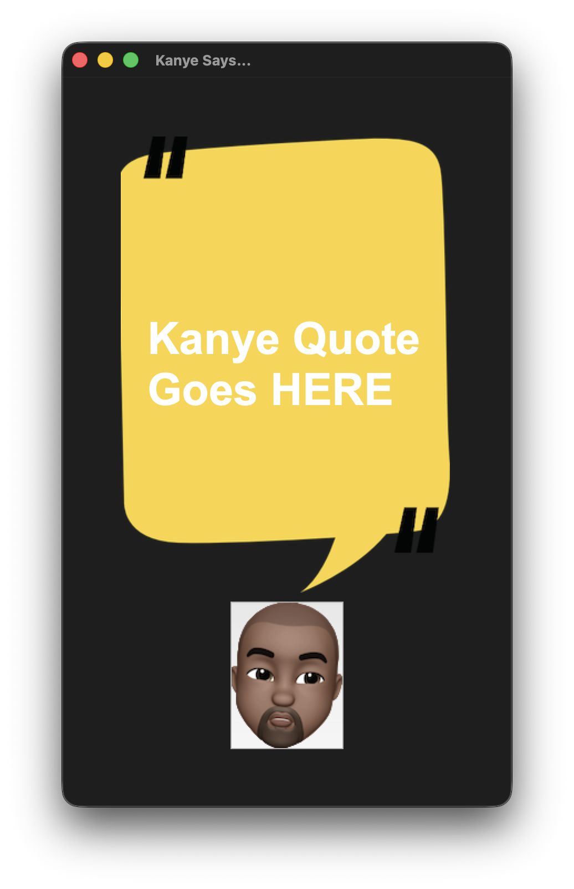
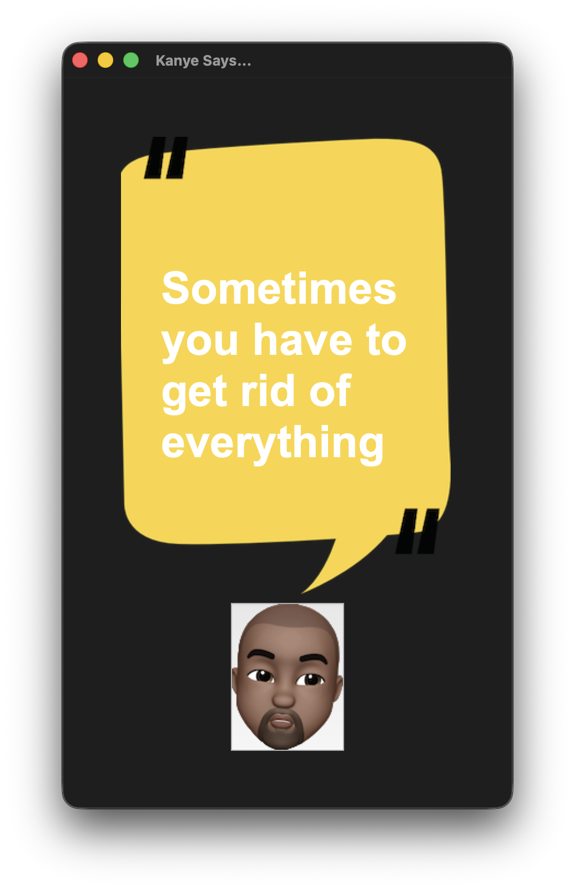
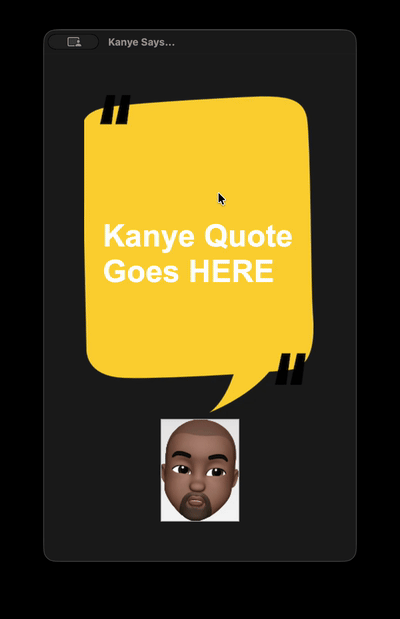

# 🎤 Kanye Quotes App

A fun desktop application that serves up random Kanye West quotes at the click of a button. Built with Python and Tkinter, this app fetches real-time quotes from the [Kanye REST API](https://api.kanye.rest) and displays them in a stylish speech bubble interface.


---

## ✨ Features

- **Random Kanye Quotes** — Fetches a new, random Kanye West quote every time you click the button
- **Clean GUI** — Minimalist speech bubble design with a custom Kanye avatar button
- **Live API Integration** — Pulls quotes in real-time from the [kanye.rest](https://api.kanye.rest) API
- **Error Handling** — Gracefully handles HTTP errors using `raise_for_status()`

## 📸 Preview

<p align="center">
  
  &nbsp;&nbsp;&nbsp;
  
</p>

### 🎬 Demo

<p align="center">
  
</p>

## 🛠️ Tech Stack

| Component     | Technology                                        |
| ------------- | ------------------------------------------------- |
| Language      | Python 3                                          |
| GUI Framework | Tkinter                                           |
| HTTP Client   | [Requests](https://docs.python-requests.org/)     |
| API           | [Kanye REST API](https://api.kanye.rest)           |

## 📦 Prerequisites

- **Python 3.x** installed on your system
- **pip** (Python package manager)

## 🚀 Getting Started

### 1. Clone the repository

```bash
git clone https://github.com/MSameer7-tech/Kanye-Quotes-App.git
cd Kanye-Quotes-App
```

### 2. Install dependencies

```bash
pip install -r requirements.txt
```

> **Note:** `tkinter` comes pre-installed with most Python distributions. If it's missing, install it via your system's package manager (e.g., `sudo apt-get install python3-tk` on Ubuntu/Debian, or `brew install python-tk` on macOS with Homebrew).

### 3. Run the app

```bash
python main.py
```

## 📁 Project Structure

```
kanye-quotes/
├── main.py              # Application entry point & GUI logic
├── background.png       # Speech bubble background image
├── kanye.png            # Kanye avatar button image
├── initial-screen.png   # Screenshot – initial state
├── quote.png            # Screenshot – quote loaded
├── demo.mov             # Screen recording (source)
├── demo.gif             # Animated demo for README
├── requirements.txt     # Python dependencies
├── LICENSE              # MIT License
├── .gitignore           # Git ignore rules
└── README.md            # You are here!
```

## 🔍 How It Works

1. The app creates a **Tkinter window** with a canvas displaying a speech bubble background image
2. A placeholder text ("Kanye Quote Goes HERE") is shown on launch
3. When the user clicks the **Kanye avatar button**, the `get_quote()` function fires
4. `get_quote()` sends a **GET request** to `https://api.kanye.rest`
5. The JSON response is parsed, and the quote text is updated on the canvas

```python
def get_quote():
    response = requests.get(url="https://api.kanye.rest")
    response.raise_for_status()
    quote = response.json()["quote"]
    canvas.itemconfig(quote_text, text=quote)
```

## 🤝 Contributing

Contributions, issues, and feature requests are welcome! Feel free to:

1. **Fork** this repository
2. **Create** your feature branch (`git checkout -b feature/amazing-feature`)
3. **Commit** your changes (`git commit -m 'Add amazing feature'`)
4. **Push** to the branch (`git push origin feature/amazing-feature`)
5. **Open** a Pull Request

## 📝 License

This project is open source and available under the [MIT License](LICENSE).

## 🙏 Acknowledgements

- [kanye.rest](https://kanye.rest) — Free REST API for random Kanye West quotes
- Kanye West — For the endless supply of quotable moments

---

<p align="center">
  Made with ❤️ and Python
</p>
